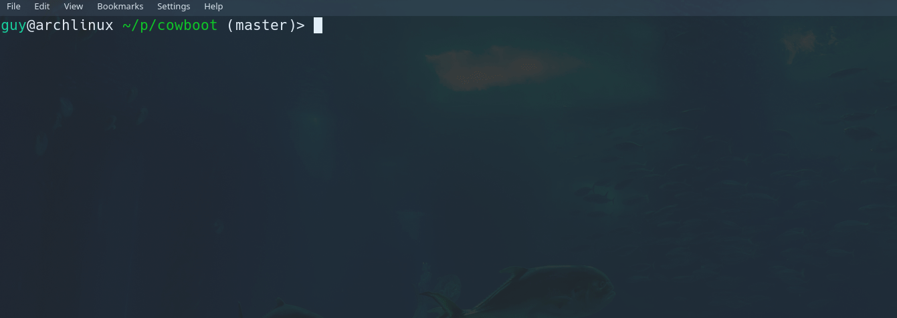

# cowboot
create a bootable USB stick with a cow saying your name!


# Why?

I (re)started to read the book [linux-insides](https://0xax.gitbooks.io/linux-insides/) in which the [booting process is discussed](https://0xax.gitbooks.io/linux-insides/Booting/linux-bootstrap-1.html).

The author writes a simple real-mode program that outputs a `'!'` character onto the screen via [INT 10H](https://en.wikipedia.org/wiki/INT_10H).

As a learning experience, I've decided to create a small boot image which displays `cowsay` with a dedicated message upon boot.

## But, cowsay?

YES. I love cows.


# Requirements
* cowsay
* unix2dos
* nasm

# Installation

```bash
make MSG=<your boot message here>
sudo make install MEDIA=<your destination media here>
```

# Read more in my blog!
click [here](https://guyonbits.com/compiling-a-simple-boot-image-for-x86/) to read the post :)

